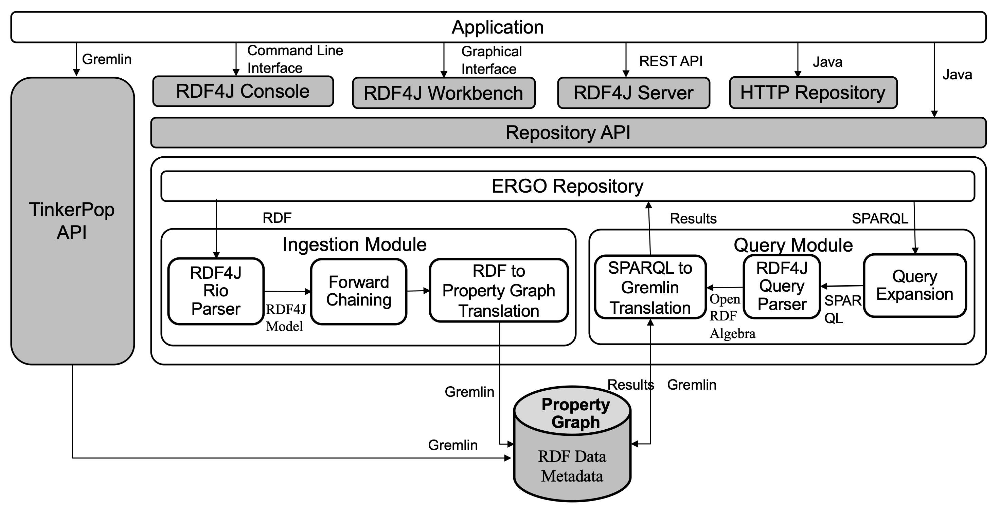
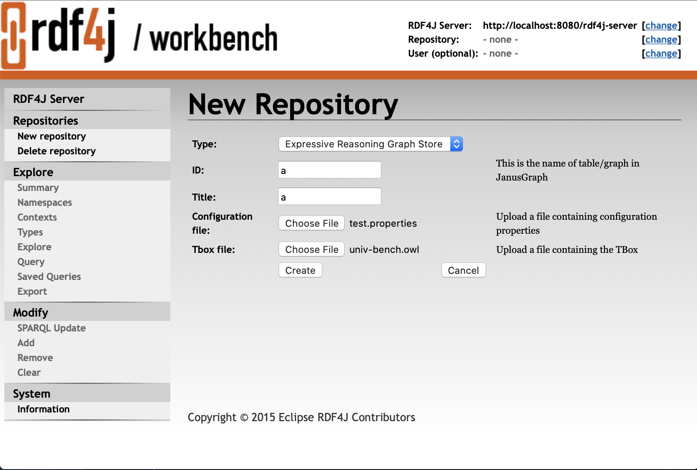

# Expressive Reasoning Graph Store(ERGS)
The Expressive Reasoning Graph Store (ERGS) is an OWL reasoner and an RDF triple store built on top of a Property Graph architecture. ERGS uses Janus Graph as the underlying graph store which can be replaced by any Apache TinkerPop compliant graph store. 

The key components and functionality of ERGS include:

- RDF to Property Graph conversion: allows storing RDF/OWL datasets in a TinkerPop compliant graph store
- SPARQL to Gremlin converter: allows running SPARQL queries over data stored in a TinkerPop compliant graph store
- Reasoner: currently, ERGS supports RDFS reasoning and few OWL constructs, with additional constructs coming soon

ERGS aims to offer a unifying graph platform to support a variety of use cases with special focus on:

- Scalability: Built on top of property graph (JanusGraph)
- Expressivity: Handles RDFS reasoning + few OWL constructs (More to be added soon)
- Adaptability: Adopts Open Standards, API based, supporting SPARQL/GREMLIN querying


## Architecture
  

## ERGS RDF4J repository Server and Workbench
  It is J2EE dynamic web project for ingestion and querying RDF data.
  
  ### Docker build
  
  #### Prerequisites
   1. Docker: Download and Install Docker from https://www.docker.com
   2. expressive-reasoning-graph-store Project: Download the project
   
  #### Steps to Deploy Web Application  
   1. In the project expressive-reasoning-graph-store execute the following command for first time build:
      ```
      docker-compose up -d --build
      ```
   2. For later executions execute the following command:
      ```
      docker-compose up -d
      ```
   3. Browse application at http://localhost:8080/rdf4j-workbench
   4. Stop docker by executing the following command: 
      ```
      docker-compose down
      ```   
  ### Maven build
  #### Prerequisites
   1. HBase
      * Download and extract a stable HBase from https://hbase.apache.org/downloads.html (2.1.5 version is tested with JanusGraph 0.4.0.).
      * Go to conf/hbase-env.sh from HBase home folder and set JAVA_HOME to java directory.
      * Create a data directory for HBase. 
      * Go to conf/hbase-site.xml from HBase home folder and replace configuration part with following
        ```
        <configuration>
          <property>
            <name>hbase.rootdir</name>
            <value>file://<path of data directory>/hbase</value>
          </property>
          <property>
            <name>hbase.zookeeper.property.dataDir</name>
            <value><path of data directory>/zookeeper</value>
          </property>
        </configuration>
        ```
      * Start HBase by invoking the start-hbase.sh script in the bin directory inside the extracted HBase directory. To stop HBase, use stop-hbase.sh(bin/start-hbase.sh and bin/stop-hbase.sh).  
   2. JanusGraph Server
      * Download and extract JanusGraph from https://github.com/JanusGraph/janusgraph/releases/download/v0.4.0/janusgraph-0.4.0-hadoop2.zip.
      * Replace graphs section in `<path of JanusGraph directory>/conf/gremlin-server/gremlin-server-configuration.yaml` with following
        ```
        graphs: {
           ConfigurationManagementGraph: <Path of expressive-reasoning-graph-store project>/RDF4J/rdf4j-repository/src/main/resources/janusgraph-hbase-configurationgraph.properties
        }
        ```
      * Start JanusGraph server by issuing the following command from the JanusGraph directory
      ``` ./bin/gremlin-server.sh conf/gremlin-server/gremlin-server-configuration.yaml ```
   3. Tomcat Server
       * Download and extract tomcat from https://tomcat.apache.org/download-70.cgi.
  #### Steps to Deploy Web Application
   1. Download this project.
   2. Update the following properties in [system.properties](https://github.com/IBM/expressive-reasoning-graph-store/blob/master/RDF4J/rdf4j-repository/src/main/resources/system.properties) file:
      1. storage.backend=hbase
      2. storage.hostname=localhost
      3. server.hostname=localhost
   3. Execute the following command
      ```
      mvn install -Dmaven.test.skip=true
      mv RDF4J/rdf4j-workbench/target/rdf4j-workbench-0.0.1-SNAPSHOT.war <path to tomcat server>/webapps/rdf4j-workbench.war
      mv RDF4J/rdf4j-server/target/rdf4j-server-0.0.1-SNAPSHOT.war <path to tomcat server>/webapps/rdf4j-server.war
      ```
   4. Execute the following command to start the tomcat server
      ```
      ./<path to tomcat server>/bin/startup.sh
      ```
 ### Creating ERGS Repository 
  1. Click on “New repository” in the sidebar menu. This brings up the “New Repository” page. You are presented with a simple form that provides a “Type:” selector with several repository types. Select "Expressive Reasoning Graph Store".
  2. The “ID:” and “Title:” fields are optional in this form. Clicking “Next” brings up a form with more fields specific to the ERGS.
  3. Fill  “ID:” and “Title:”, choose configuration([Sample](https://github.com/IBM/expressive-reasoning-graph-store/blob/master/RDF4J/rdf4j-repository/src/main/resources/test.properties)) and Tbox([Sample](https://github.com/IBM/expressive-reasoning-graph-store/blob/master/RDF4J/rdf4j-repository/src/test/resources/lubm/univ-bench.owl)) file before the “Create” button may be clicked. The configuration file contains following configuration parameters:
      1. input.enableforwardchaining (true/false): enable forward chaining (optional, default is false)
      2. input.commitfrequency: RDF triples commite size (required, default value is 10000 triples)
      3. input.numthreads: degree of parallalism (required, default value is 1 thread)
      4. input.indexprop: list of graph property to be indexed using janusgraph (optional)
      5. input.textindexprop: list of graph property to be indexed using solr in text form (optional)
      6. input.stringindexprop: list of graph property to be indexed using solr in string form (optional)
      7. input.textstringindexprop: list of graph property to be indexed using solr in text-string form (optional)
      <!---8. input.buildallpropindex (true/false): create combined index on all properties (optional, default is false)--->
  4. This will create a new ERGS repository. 
   

 ### Ingesting data into ERGS Repository 
  [Sample](https://github.com/IBM/expressive-reasoning-graph-store/blob/master/RDF4J/rdf4j-repository/src/test/resources/lubm/University0_0.owl)
  1. Using RDF4J Workbench/GUI: Follow the [steps](https://rdf4j.org/documentation/tools/server-workbench/#add)
  2. Using RDF4 Server/Rest API: [API definition](https://rdf4j.org/documentation/reference/rest-api/#the-add-operation)
  3. BulkLoading(with docker): Execute the following command	
      ```
      bash docker/bulkloading/load-data.sh <repository id> <dataset directory> <dataset format> <base uri>
      ```
      Permissible `dataset format` are: 'rdf', 'turtle', 'ntriples', 'n3'.
  
      It uses [docker/bulkloading/bulkload.properties](https://github.com/IBM/expressive-reasoning-graph-store/blob/master/docker/bulkloading/bulkload.properties) for ingestion.The configuration file contains following configuration parameters:
      1. input.enableforwardchaining (true/false): enable forward chaining (optional, default is false)
      2. input.commitfrequency: RDF triples commite size (required, default value is 10000 triples)
      3. input.numthreads: degree of parallalism (required, default value is 1 thread)
      4. input.indexprop: list of graph property to be indexed using janusgraph (optional)
      5. input.textindexprop: list of graph property to be indexed using solr in text form (optional)
      6. input.stringindexprop: list of graph property to be indexed using solr in string form (optional)
      7. input.textstringindexprop: list of graph property to be indexed using solr in text-string form (optional)
      <!---8. input.buildallpropindex (true/false): create combined index on all properties (optional, default is false)--->
 **Note: We strongly recommend of using Bulkloading for ingesting large data.**     
 ### Querying ERGS Repository 
  [Sample](https://github.com/IBM/expressive-reasoning-graph-store/blob/master/RDF4J/rdf4j-repository/src/test/resources/lubm/queries.txt)
  1. Using RDF4J Workbench/GUI: Follow the [steps](https://rdf4j.org/documentation/tools/server-workbench/#querying-a-repository)
  2. Using RDF4 Server/Rest API: [API definition](https://rdf4j.org/documentation/reference/rest-api/#repository-queries)
  
  ## References
  1. [JanusGraph](https://janusgraph.org)
  2. [RDF4J](https://rdf4j.org)
  3. [Apache Jena](https://jena.apache.org)
  4. [OWL API](http://owlcs.github.io/owlapi)
  5. [JFact](http://jfact.sourceforge.net)
  6. [Quetzal](https://github.com/Quetzal-RDF/quetzal)
